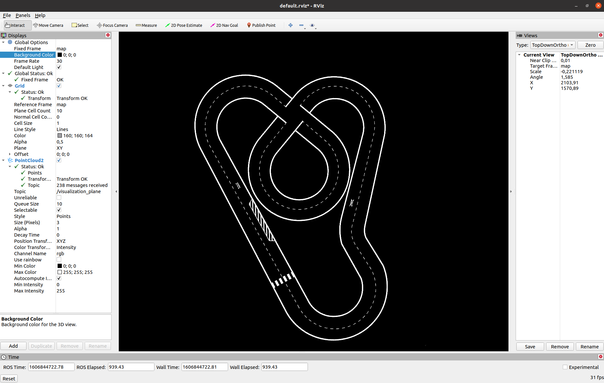

# Image 2 RViz

## Compatibility

Version | Support
---|---
Noetic | yes


## Description

This package allows you to send a _static_ image to the RViz 3D visualization display. 
It converts the image to a PointCloud2 message which can be displayed in RViz without additional plugins.

**This is most certainly not the perfect solution. But ROS is an imperfect world and 
you may need to customize this to work for you.**

To reduce bandwidth the image can be scaled down and the publishing frequency can be set a low value.
If the image is scaled down, the points in the point cloud will be further apart to keep the true resolution in the simulated world.

By default the image is displayed in the XY-Plane with a Z-value of 0.

You can override this behaviour by replacing the static frame transformation.

The Parameter `pixel_per_meter` lets you control how much world is represented by an image pixel. Default is 0.002m (500 pixel per meter).

## Roslaunch Examples

**RGB reduced size every 5s with moved origin:**

```
roslaunch img2rviz img2rviz.launch imgPath:=/home/daniel/Pictures/img.png frequency:=0.2 scaleFactor:=3 orig_x:=-1 orig_y:=-2
```

**Grayscale fullsize every 1s with 1000 pixel/m:**

```
roslaunch img2rviz img2rviz.launch imgPath:=/home/daniel/Pictures/img.png frequency:=1 scaleFactor:=1 grayscale:=true pixel_per_meter:=1000
```

## Installation

You need a catkin workspace and you need [ros_numpy](https://github.com/eric-wieser/ros_numpy) besides this package in `src`.

```
source /opt/ros/noetic/setup.bash
cd catkin_ws/src
git clone https://github.com/eric-wieser/ros_numpy.git
git clone https://github.com/dketterer/img2rviz.git
cd ..
catkin_make
source devel/setup.bash
```

## Settings in RViz

* Add a PointCloud2 Display
* Select the Topic `/visualization_plane`
* Style: Points
* Size (Pixels): 3 (maybe larger, depending on the image size)
* Position Transformation: XYZ

For _RGB_:
* Color Transformation: RGB32

For _grayscale_:
* Color Transformation: Intensity
* Channel Name: rgb
Use rainbow: no (uncheck)


